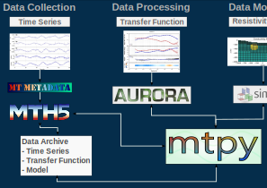

# Magnetotellurics and Open Source Codes With Examples🧙

This book provides documentation and examples of how to use the various open source codes for magnetotelluric (MT) data.

**Authors:** Jared Peacock<sup>1</sup>, Karl Kappler<sup>2</sup>, Seogi Kang<sup>3</sup>, Mike Mitchell<sup>4</sup>, Alison Kirkby<sup>5</sup> \
**Affiliations:** <sup>1</sup>U.S. Geological Survey, <sup>2</sup>DIAS Geophysics, <sup>3</sup>Univeristy of Manitoba, Canada, <sup>4</sup>U.S. Geological Survey, <sup>5</sup>GNS, New Zealand\
**License:** CC BY 4.0

**Abstract**

The goal of this book is to provide executable examples of how to use open-source Python software packages written to deal with MT data, including [mt-metadata], [mth5], [aurora], [mtpy-v2], and [simpeg].

## Background

The initial work on open-souce software was focused on transfer functions (reading/writing, plotting, analysis, working with model input/outputs).  That work resulted in [mtpy], which was a general collection of scripts compiled into a repository with some object oriented code [Krieger \& Peacock, 2014](https://doi.org/10.1016/j.cageo.2014.07.013).  The package was extended mainly by a group at Geoscience Australia into a more modern package including a testing framework and publishing to PyPi [Kirkby _et al._, 2019](https://doi.org/10.21105/joss.01358).  [mtpy] underwent went small updates but due to some unfortunate circumstances became unmaintainable and is now deprecated (**mtpy is deprecated. New version is mtpy-v2**).

Starting around 2020, a working group for metadata and data standards was created, led by IRIS, now Earthscope.  The goal of this group was to develop a standard set of metadata for MT data as well as a data standard.  Out of this came [mt-metadata], a metadata standard, and [mth5], a data format standard based on HDF5 ([Peacock _et al._, 2022](https://doi.org/10.1016/j.cageo.2022.105102)).  Moreover, development of a processing code to estimate MT transfer functions was also supported which resulted in [aurora] a processing code based on Gary Egbert's EMTF code [Kappler _et al._, 2024](https://doi.org/10.21105/joss.06832). 

There have been recent developments in [simpeg] that incorporates inversion of MT data in 1D, 2D, and 3D.  Originally [simpeg] was designed as a package for learning but in recent years has included modules for parallelization and multi-procssing that allows for larger datasets to be inverted.  

## General Workflow
With all these packages the full workflow of MT data is covered including data collection, data archiving, transfer function estimation, and modeling [](#mt-workflow).  We have tried to set it up such that [mtpy-v2] is the main controlling package that interfaces with the other packages, but that is still a work in progress.  

```{figure} 
:label: mt-workflow
:width: 400px
:align: center



General workflow for dealing with MT data.  Time series data can be stored and archived in an MTH5 file which includes metadata. The MTH5 file(s) with time series data can then be used to estimate transfer functions using [aurora].  [aurora] can be controlled from [mtpy-v2] to estimate transfer functions, which are stored the input MTH5 file.  A collection of transfer functions can then be modelled with [simpeg], current controllers from [mtpy-v2] include 1D and 2D, 3D soon.   

```


[2i2c]: https://2i2c.org/
[curvenote]: https://curvenote.com
[docutils]: https://docutils.sourceforge.io/
[executablebooks]: https://executablebooks.org/
[jupyterbook]: https://jupyterbook.org/
[jupyterlab-myst]: https://github.com/jupyter-book/jupyterlab-myst
[sphinx]: https://www.sphinx-doc.org/
[mt-metadata]: https://github.com/kujaku11/mt_metadata
[mth5]: https://github.com/kujaku11/mth5
[mtpy]: https://github.com/MTgeophysics/mtpy
[mtpy-v2]: https://github.com/MTgeophysics/mtpy-v2
[aurora]: https://github.com/simpeg/aurora
[simpeg]: https://github.com/simpeg/simpeg 
